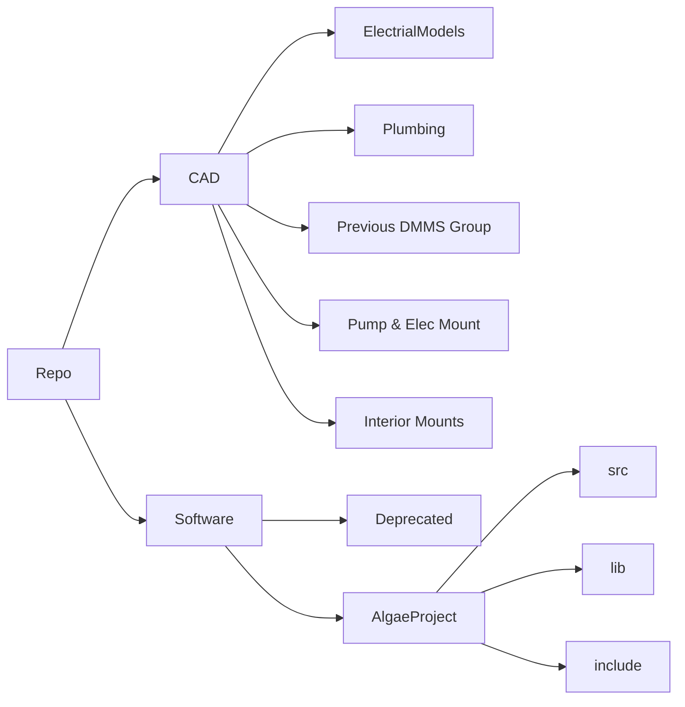

# Algae_Panel
repo for the storage of files related to the control and operation of an Algae Bio-panel at UTS

## [CAD ](/CAD/README.md)
### **Contains:**
- Solidworks Files
- STLs
- Drawings & Assembly Diagrams 
- Product Information

## [Software ](/Software/README.md)
### **Contains:**
- Installation & Setup Guide
- Doxygen Documentation
- Tips for making modifications & using placed systems.

---
### Visual Layout of Repo

